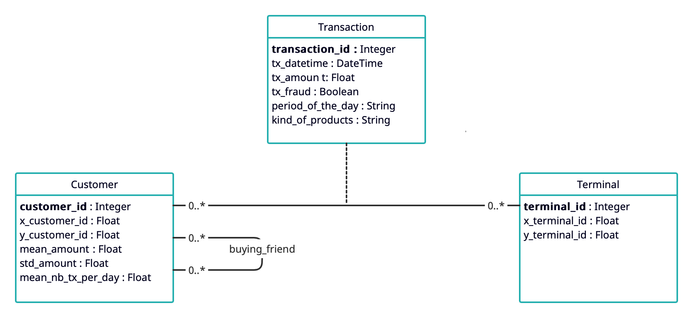

# 1. Generation of the datasets
We have modified the generation scripts in order to fulfill our needs.  
The file *generator.py* contains the methods for the random generation of the datasets.  
The generated data is stored in csv files, and located in subfolders of the *datasets* folder.  
Users can choose the size of the datasets in multiple of 50 MB, by changing the values inside the *sizes* array.  
For example, the folder *2* will contain a dataset of size ≈ 100 MB.

# 2. Conceptual model
Considering the requirements, we have defined the *Customer* and *Terminal* classes.  

Each *Customer* will be defined by the following properties:
-   **customer_id**: The customer unique ID
-   x_customer_id: latitude of the coordinates of the customer's location
-   y_customer_id: longitude of the coordinates of the customer's location
-   mean_amount : The mena of the transaction amounts for the customer, drawn from a uniform distribution (5,100).
-   std_amount: The standard deviation of the transaction amounts for the customer, the mean_amount divided by two.
-   mean_nb_tx_per_day: The average number of transactions per day for the customer, drawn from a uniform distribution (0,4).

And the *Terminal* will have the following properties:
-   **terminal_id**: The terminal ID
-   x_terminal_id: latitude of the coordinates of the terminal's location
-   y_terminal_id: longitude of the coordinates of the terminal's location 

*(locations are defined in a 100 x 100 grid)*


A *Transaction* is the product of an operation made from a *Customer* on a *Terminal*, 
so we decided to represent it as an association entity, with the following properties:
-   **transaction_id**: A unique identifier for the transaction.
-   tx_datetime: Date and time at which the transaction occurs.
-   *customer_id*: The unique identifier for the customer. 
-   *terminal_id*: The unique identifier for the terminal.
-   tx_amount: The amount of the transaction.
-   tx_fraud: A binary variable, false for a legitimate transaction, or true for a fraudulent transaction.


Since the requirements didn't specify any constraint, the association is a many-to-many 
because in the real world a customer can make any number of transactions, 
and in a terminal can be made any number of transactions.  
The attributes are the same described in the original dataset.
We omitted the customer_id and terminal_id in *Transaction*,
because they are implicit in the many-to-many association.


For the sake of completeness, we decided to make a conceptual model of the domain with the required extensions 
of period_of_the_day and kind_of_products for *Transaction*, and buying_friend relationship for *Customer*.
extension for *Customer*:
-   buying_friend: customers who made more than three transactions related to the same types of products 
    on the same terminal
extension for *Transaction*:
-   PERIOD_OF_THE_DAY: A string containing the period of the day {morning, afternoon, evening, night}
    in which the transaction has been executed.
-   KIND_OF_PRODUCTS: A string containing the kind of products that have been bought through the transaction
    {high-tech, food, clothing, consumable, other}.


# 3. Logical model
We chose Neo4j as NoSQL system because of its nature: 
the existing model could be easily represented as a property graph, 
where the needed queries could be efficiently executed on graph links.  
The *Customer* and *Terminal* classes are represented by nodes, because they are independent,
while the *Transaction* association is a link between a Customer and a Terminal because it depends on them.


Here is the graph representation of some mock data:


The logical model was extended to represent the additional requirements:
- buying_friend becomes an edge between two Customer nodes
- period_of_the_day and kind_of_products become new attributes of the Transaction relationship


Here is the graph representation of some mock data:


# 4. Loading of the datasets
Python can communicate with Neo4j using the *neo4j* module.  
The loading of the datasets on the Neo4j system is done by a Python script contained in the *loading.py* file.  
Users can choose the dataset to load by setting the *dataset* variable accordingly, 
and change the database URI based on their host, and the authentication credentials.  
``` python
dataset = "1"

uri = "bolt://localhost:7687"
driver = GraphDatabase.driver(uri, auth=(username, password))
```

The paths of the datasets are computed based on the chosen dataset,
and a connection session is created.
``` python
from_root = str(pathlib.Path(__file__).parent.resolve())
file_path = "file://" + from_root + "/datasets/" + dataset + "/"

with driver.session() as session:
    while session.run(IS_CONTENT).value(default=False):
        session.run(DROP_CONTENT)

    session.run(CUSTOMER_INDEX)
    session.run(TERMINAL_INDEX)

    session.run(load_customers(file_path + "customers-" + dataset + ".csv"))
    session.run(load_terminals(file_path + "terminals-" + dataset + ".csv"))
    session.run(load_transactions(file_path + "transactions-" + dataset + ".csv"))

    print("write transaction " + "failed" if session._state_failed else "completed")

driver.close()
```

The first step is the deletion of the data contained in the Neo4j database, using the following queries:
``` python
IS_CONTENT = "MATCH (n) RETURN true LIMIT 1"
DROP_CONTENT = "MATCH (n) CALL { WITH n DETACH DELETE n } IN TRANSACTIONS OF 10000 ROWS"
```

Indexes are created using the following queries:
```
CUSTOMER_INDEX = "CREATE INDEX cust_id IF NOT EXISTS FOR (c:Customer) ON (c.customer_id) "
TERMINAL_INDEX = "CREATE INDEX term_id IF NOT EXISTS FOR (t:Terminal) ON (t.terminal_id) "
TRANSACTION_INDEX = "CREATE INDEX trans_id IF NOT EXISTS FOR ()-[t:TRANSACTION]-() ON (t.transaction_id)"
```

Then the *Customer* and *Terminal* nodes are created by loading the CSV files on Neo4j using Cypher's constructs.
``` python
def load_customers(PATH):
    return (
            "USING PERIODIC COMMIT 1000 " +
            "LOAD CSV WITH HEADERS FROM \"" + PATH + "\" AS row " + 
            "CREATE (c:Customer {customer_id : toInteger(row.customer_id), " +
            "x_customer_id : toFloat(row.x_customer_id)," + 
            "y_customer_id : toFloat(row.y_customer_id), " +
            "mean_amount : toFloat(row.mean_amount), " + 
            "std_amount : toFloat(row.std_amount), " + 
            "mean_nb_tx_per_day : toFloat(row.mean_nb_tx_per_day) })")

def load_terminals(PATH):
    return (
            "USING PERIODIC COMMIT 1000 " +
            "LOAD CSV WITH HEADERS FROM \"" + PATH + "\" AS row " + 
            "CREATE (t:Terminal { terminal_id : toInteger(row.terminal_id), " +
            "x_terminal_id : toFloat(row.x_terminal_id), " +
            "y_terminal_id : toFloat(row.y_terminal_id) })")
```

Finally, the *Transaction* edges are created by matching the respective *Customer* and *Terminal* nodes involved in the operation.
``` python
def load_transactions(PATH):
    return (
            "USING PERIODIC COMMIT 1000 " +
            "LOAD CSV WITH HEADERS FROM \"" + PATH + "\" AS row " +  
            "MATCH (c:Customer {customer_id : toInteger(row.customer_id)}), " +
            "(t:Terminal {terminal_id : toInteger(row.terminal_id)}) " +
            "CREATE (c)-[tx:TRANSACTION { " + 
            "transaction_id : toInteger(row.transaction_id), " +
            "tx_datetime : datetime({epochSeconds: toInteger(row.tx_datetime)}), " +
            "tx_amount : toFloat(row.tx_amount), " + 
            "tx_fraud : toFloat(row.tx_fraud) }]->(t) ")
```


# 5. Implementation of the required queries
The required queries are reported here in the Cypher language, and implemented as methods in the file *queries.py*

1.  For each customer, identify the amount that they have spent for every day of the current month.
```
MATCH (c:Customer)-[t:TRANSACTION]->()  
WHERE t.tx_datetime.year = datetime().year AND t.tx_datetime.month = datetime().month
RETURN c.customer_id, t.tx_datetime.day, SUM (t.tx_amount)
ORDER BY c.customer_id, t.tx_datetime.day
```

2.  For each terminal identify the possible fraudulent transactions *occurred in the current month*.  
    The fraudulent transactions are those whose import is higher
    than 50% of the import of the transactions 
    executed on the same terminal in the last month.

    For this request, two different Cypher queries are needed.
    The results of the first query are used by the Python script to call the second one.

    a.  For each terminal, identify the average import of the transactions executed in the last month.
    ```
    MATCH ()-[lt:TRANSACTION]->(tr:Terminal)
    WHERE
        (datetime().month = 1 AND lt.tx_datetime.month = 12 AND lt.tx_datetime.year = datetime().year - 1)
    OR 
        (datetime().month > 1 AND lt.tx_datetime.month = datetime().month - 1 AND lt.tx_datetime.year = datetime().year)
    RETURN tr.terminal_id, AVG(lt.tx_amount) as average 
    ```
    If the current month is January, then the query checks the transactions from December of the last year.
    Otherwise, it simply checks the transactions of the last month and same year.  

    The parameters of the first query, *$terminal_id* and *$average*, are passed as arguments to the second query.

    b.  Given a terminal_id and the average import of the transactions executed in the last month on that terminal,
        return the possible fraudulent transactions executed in the current month. 
        
    ```
    MATCH ()-[t:TRANSACTION]->(tr:Terminal {terminal_id: $terminal_id})
    WHERE t.tx_datetime.year = datetime().year AND t.tx_datetime.month = datetime().month AND t.tx_amount > $average / 2
    RETURN t
    ```

3.  Given a user u, determine the “co-customer-relationships CC of degree k”.
    A user u’ is a co-customer of u if you can determine a chain “u1-t1-u2-t2-...tk-1-uk“ such that u1=u, uk=u’,
    and for each 1<=I,j<=k, ui <> uj, and t1,..tk-1 are the terminals on a transaction has been executed.
    Therefore, CCk(u)={u’| a chain exists between u and u’ of degree k}

    For this operation, an additional link is needed.

    a.  Create the co-customer link for degree k=1 (if not exists)
    ```
    MATCH (u1:Customer)-[]->(t:Terminal)<-[]-(u2:Customer)
    WHERE u1.customer_id > u2.customer_id AND NOT ((u1)-[:CO_CUSTOMER]-(u2))
    MERGE (u1)-[:CO_CUSTOMER]->(u2)
    ```
    The customer_ids need to be different, because a *Customer* can't be co-customer of itself.  
    However, if the <> operator is used, Neo4j would create two different edges for the relationship.  
    We want to avoid this because it would make possible to visit a node multiple times,
    so we use the > operator instead to achieve uniqueness.
    

    b.  See all the co-customers of *Customer* with id $customer_id, of degree $degree
    ```
    MATCH (u1:Customer{customer_id : $customer_id})-[:CO_CUSTOMER*$degree]-(u2)
    WHERE u1.customer_id <> u2.customer_id
    RETURN DISTINCT (u2.customer_id)
    ```
    The operator * in the association indicates how deep the recursion should go on the CO_CUSTOMER link.
    The match need to have no direction because of situations like:
    ```
    {id : 5} -> {id : 4} <- {id : 6}
    ```

4.  Extend the logical model. See *Logical Model* for more details.
    a.  Extend *Transaction* with random values for period_of_the_day, kind_of_products.
    ``` python
    import random

    PERIODS = ['morning', 'afternoon', 'evening', 'night']
    KINDS = ['high-tech', 'food', 'clothing', 'consumable', 'other']

    def extend_transactions():
        with driver.session() as session:            
            ids = session.run("MATCH ()-[t:TRANSACTION]->() RETURN t.transaction_id").values()
            for i in range(0,len(ids)):
                period_of_the_day = PERIODS[random.randint(0,len(PERIODS)-1)]
                kind_of_products = KINDS[random.randint(0,len(KINDS)-1)]
                session.run("MATCH ()-[t:TRANSACTION {transaction_id : $id}]-() " + 
                            "SET t.period_of_the_day = $period_of_the_day, " + 
                            " t.kind_of_products = $kind_of_products",
                            id=ids[i], period_of_the_day=period_of_the_day, kind_of_products=kind_of_products)
    ```

    b. Add the *buying_friends* link.
    ```
    MATCH (c1:Customer)-[tx:TRANSACTION]->(t)<-[]-(c2:Customer),
    (c1)-[t1:TRANSACTION{kind_of_products : tx.kind_of_products}]->(t), 
    (c2)-[t2:TRANSACTION{kind_of_products : tx.kind_of_products}]->(t)
    WITH c1, c2, COUNT(DISTINCT t1) AS count_1, COUNT(DISTINCT t2) AS count_2
    WHERE c1.customer_id > c2.customer_id AND count_1 > 3 AND count_2 > 3
    MERGE (c1)-[:BUYING_FRIEND]->(c2)
    ```


    Given a *Customer* with id customer_id, determine its buying friends
    and return a list containing their customer_ids
    ```
    MATCH (c:Customer {customer_id : $customer_id})-[:BUYING_FRIEND]-(u)
    RETURN c.customer_id, COLLECT(u.customer_id)
    ```

5.  For each period of the day identifies the number of transactions that occurred in that period,
    and the number of fraudulent transactions.

    ```
    MATCH ()-[t:TRANSACTION]->()
    RETURN t.period_of_the_day, count(t) as transactions_count, count(CASE WHEN t.tx_fraud = true THEN 1 END) as fraud_count
    ```
# 6. Performances discussion

We chose to use the periodic commit because of the large amount of rows to load from the CSV files. This reduces the memory overhead of the transaction.

If no index is created, the loading of 1000 *Transactions* from a CSV would take 128 seconds on average, for the 50 MB dataset, with 200000 *Customers* and 200000 *Terminals*.  
This means an average time of 64000 seconds, almost 18 hours, for the loading of the 500000 transactions of the 50 MB dataset.  
This happens because of the matches that the query does before the creation of *Transaction*.
The creation of indexes on *Customer*.*customer_id* and *Terminal*.*terminal_id* improve the performances drastically: the loading of 1000 *Transactions* takes on average 95 milliseconds, and the whole collection of 500000 *Transactions* is loaded on average in 34 seconds.

## Timings with indexes
### **Customer**
dataset|size|quantity|average loading time
-------|----|--------|---
 *1*   | a  | 200000 | 7.0s
 *2*   | a  | 400000 | 13.8s
 *4*   | a  | 800000 | 27.3s

### **Terminal**
dataset|size|quantity|average loading time
-------|----|--------|---
 *1*   | a  | 200000 | 5.9s
 *2*   | a  | 400000 | 11.6s
 *4*   | a  | 800000 | 23.0s

### **Transaction**
dataset|size|quantity|average loading time
-------|----|--------|---
 *1*   | a  | 500000 | 33.9s
 *2*   | a  | 1000000| 68.5s
 *4*   | a  | 2000000| 2m 19.6s

We created an index on *Transaction*.*transaction_id*. 
The purpose of this index is to improve performances while retrieving the *Transactions* by their id during the extension of the *Transaction* relationship.
The extension time of 1000 *Transactions* without the indexes was of 850 seconds. 
With the index, 1000 *Transactions* are loaded in just 19.5 seconds.

### **Transaction extension**
dataset|size|quantity|average extension time
-------|----|--------|---
 *1*   | a  | 500000 | 2h 40m
 *2*   | a  | 1000000| 5h 22m
 *4*   | a  | 2000000| 10h 31m